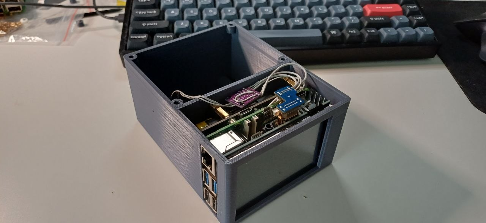

# NOSTROMO Terminal

A retro-futuristic Raspberry Pi 5 terminal inspired by the MU-TH-UR 6000 computer from Ridley Scott's *Alien* (1979). Features a CRT-style interface with AI conversation (Claude API), YouTube media playback, and hot-switchable screens — all running on a 3.5" display with a custom 3D-printed enclosure.



## Overview

Nostromo is a standalone terminal device built around Raspberry Pi 5 with a WaveShare 3.5" HDMI touchscreen. It combines a sci-fi aesthetic with practical functionality: AI assistant access, media playback, and an immersive boot sequence that recreates the MU-TH-UR 6000 experience.

The project includes both the software (Python/pygame) and the hardware design (OpenSCAD enclosure, I²S audio, 3D-printed case).

## Features

- **MU-TH-UR 6000 AI Terminal** — CRT-style green phosphor interface with Claude API backend, typewriter text effects, scanlines
- **Claude Terminal** — General-purpose AI assistant with the same retro aesthetic
- **YouTube Player** — Native video playback with ffpyplayer, OSD overlay, keyboard controls
- **Hot-switching** — Alt+1/2/3 switches between screens instantly; background audio continues
- **Boot sequence** — Authentic startup animation inspired by the Nostromo's onboard systems
- **I²S audio** — Digital audio path via MAX98357A amplifier, mono mix through ALSA
- **3D-printed enclosure** — Custom case designed in OpenSCAD, FDM optimized
- **Remote control app** — Android companion app (Flutter) for sharing YouTube links and controlling playback from your phone

## Hardware

### Bill of Materials

| Component | Specification | Notes |
|-----------|--------------|-------|
| Raspberry Pi 5 | 4GB or 8GB | Main compute |
| WaveShare 3.5" HDMI LCD | 480×320, resistive touch | Sits on GPIO header |
| MAX98357A | I²S DAC + 3W amplifier | Digital audio, no analog noise |
| Speaker | 90×50mm oval, 8Ω, 6W | Side-firing orientation |
| UPS HAT | Dual 18650 | Optional, for portability |
| 3D-printed enclosure | PLA+, ~134×98×67mm | Two compartments: RPi + speaker |

### Wiring — I²S Audio

```
RPi5 GPIO              MAX98357A
─────────              ─────────
Pin 4  (5V)     ───→   VIN
Pin 6  (GND)    ───→   GND
Pin 12 (GPIO18) ───→   BCLK
Pin 35 (GPIO19) ───→   LRC
Pin 40 (GPIO21) ───→   DIN
                       GAIN  → floating (mono L+R mix)
                       SD    → VIN (enable)
```

### Enclosure

The case is designed in OpenSCAD with two internal compartments:

- **Left compartment** — Raspberry Pi 5 + UPS HAT stack
- **Right compartment** — Sealed speaker chamber with damping material

Speaker is side-firing for optimal speech clarity at desk distance.

## Software Architecture

```
main.py                          ← Entry point
├── nostromo/
│   ├── __init__.py              ← Package config, constants
│   ├── app.py                   ← NostromoApp base (pygame, CRT rendering)
│   ├── screen.py                ← Screen interface (activate/deactivate/is_alive)
│   └── manager.py               ← ScreenManager (main loop, hot-switching)
├── screens/
│   ├── ai_terminal.py           ← Shared AI terminal base (Claude API, typewriter)
│   ├── claude.py                ← Claude config + system prompt
│   ├── mother.py                ← MU-TH-UR 6000 config + system prompt
│   └── ytplay.py                ← MediaScreen (ffpyplayer, video + audio)
├── api/
│   └── server.py                ← HTTP API for mobile remote control
└── start.sh                     ← Startup script with auto-restart
```

### Key Design Decisions

- **Monolithic single-process** — All screens in one pygame process for instant switching
- **Lazy initialization** — Screens created on first activation
- **Background audio** — ytplay continues audio when switching screens; video decoding pauses
- **Shared AI base** — Claude and MU-TH-UR share `AITerminalScreen`, only config differs

## Audio Configuration

Pure digital audio path: RPi5 → I²S → MAX98357A → speaker.

### ALSA Mono Mix

```
# /etc/asound.conf
pcm.!default {
    type plug
    slave.pcm "mono"
}

pcm.mono {
    type route
    slave.pcm "plughw:0"
    ttable.0.0 1
    ttable.1.0 1
}
```

### Sound Card Ordering

```
# /etc/modprobe.d/alsa-base.conf
options snd_soc_rpi_simple_soundcard index=0
options vc4 index=1
```

### I²S Overlay

```
# /boot/firmware/config.txt
dtoverlay=hifiberry-dac
```

### Wi-Fi Power Management

Disable Wi-Fi power saving to prevent video buffering stutters:

```bash
sudo iw dev wlan0 set power_save off
sudo nmcli connection modify "<your-ssid>" wifi.powersave 2
```

The first command takes effect immediately, the second persists across reboots.

## Installation

### Prerequisites

- Raspberry Pi OS (Bookworm)
- Python 3.11+
- pygame, anthropic, ffpyplayer, yt-dlp

### Setup

```bash
git clone https://github.com/zmushko/Nostromo.git
cd Nostromo/software
pip install pygame anthropic ffpyplayer yt-dlp --break-system-packages
export ANTHROPIC_API_KEY="sk-ant-..."
python3 main.py --fullscreen
```

### Auto-start on boot

Nostromo starts automatically via autologin on tty1:

1. **Getty autologin** — `/etc/systemd/system/getty@tty1.service.d/override.conf`:
   ```ini
   [Service]
   ExecStart=
   ExecStart=-/sbin/agetty --autologin pi --noclear %I $TERM
   ```

2. **Bash profile** — `~/.bash_profile` launches `start.sh` only on tty1:
   ```bash
   if [ "$(tty)" = "/dev/tty1" ]; then
       exec ~/mother/start.sh
   fi
   ```

3. **`start.sh`** — sets up environment and auto-restarts on crash:
   ```bash
   export ANTHROPIC_API_KEY="your-key"
   export SDL_VIDEODRIVER=kmsdrm
   export SDL_AUDIODRIVER=alsa
   export AUDIODEV=plughw:2
   cd /home/pi/mother
   while true; do
       python3 main.py --fullscreen 2>> logs/nostromo.log
       sleep 3
   done
   ```

Crash logs are in `/home/pi/mother/logs/nostromo.log`.

Alternatively, a systemd service file (`mother.service`) is provided for `systemctl`-based setups.

## Printing the Enclosure

### Recommended Settings

| Parameter | Value |
|-----------|-------|
| Material | eSUN PLA+ or PLA+HS |
| Nozzle temp | 215–220°C |
| Bed temp | 55–60°C |
| Layer height | 0.2mm |
| Infill | 20% |
| Speed | 50–80 mm/s |
| Retraction | 5mm (Bowden) |
| Brim | 5mm (for glass bed) |

### Assembly Hardware

- M2.5 heat-set inserts for RPi5 mounting
- M3 heat-set inserts (OD 3.77mm) for case assembly
- M2.5×6 screws

### Tolerances

+0.5mm clearance on all component pockets for FDM printing.
Print a test pocket before committing to the full case.

## Controls

| Key | Action |
|-----|--------|
| Alt+1 | Switch to Claude terminal |
| Alt+2 | Switch to MU-TH-UR 6000 |
| Alt+3 | Switch to YouTube player |
| Enter | Send message / Confirm |
| Esc | Back / Exit current mode |
| ↑/↓ | Scroll history |

## Acknowledgments

This project was developed in collaboration with **Claude** (Anthropic), who served as co-designer for the software architecture, acoustic design, hardware selection, and enclosure engineering.

The MU-TH-UR 6000 interface and Nostromo name are references to the 1979 film *Alien*, directed by Ridley Scott. This is a fan project with no commercial affiliation.

## License

GPL-3.0
